# SISOP-4-2026-IT-004
Nama  : Ni Putu Maqueenta Wijaya  
NRP   : 5027251004  
## Laporan
### Soal 1
Soal pertama meminta kita untuk mendownload arsip `Amba Files` dari link:
```
https://drive.google.com/file/d/1nLXFhptDo2mnUlZsw8pTWyAVpV49W20U/view?usp=drive_link
```
Setelah di-download, isi file tersebut di-unzip kemudian zipfile asli dihapus dengan command
```
rm -f amba_files.zip
```
Setelah unzip dan menghapus file zip asli, soal 1 meminta untuk membuat file `kenz_rescue.c` yang menerima dua argumen yakni `souce_directory` dan `mount_directory`. Isi dari file `kenz_rescue.c` adalah sebagai berikut:
```c
#define FUSE_USE_VERSION 31
#include <fuse3/fuse.h>
#include <stdio.h>
#include <stdlib.h>
#include <string.h>
#include <errno.h>
#include <fcntl.h>
#include <unistd.h>
#include <sys/stat.h>
#include <dirent.h>

static const char *source_dir = NULL;
static char *tujuan_content = NULL;
static size_t tujuan_size = 0;
```
Berisi header dan definisi versi FUSE, library yang digunakan, dan variabel global.
```c
static char* build_tujuan_content(void) {
    const int count = 7;
    const char *files[] = {"1.txt","2.txt","3.txt","4.txt","5.txt","6.txt","7.txt"};

    char *fragments = strdup("");       /* akan menampung gabungan fragmen */
    size_t frag_len = 0;

    for (int i = 0; i < count; i++) {
        char path[PATH_MAX];
        snprintf(path, sizeof(path), "%s/%s", source_dir, files[i]);

        FILE *fp = fopen(path, "r");
        if (!fp) {
            fprintf(stderr, "Error opening %s\n", path);
            free(fragments);
            exit(1);
        }

        char line[4096];
        int found = 0;
        while (fgets(line, sizeof(line), fp)) {
            /* Cari baris dengan prefix "KOORD:" */
            if (strncmp(line, "KOORD:", 6) == 0) {
                const char *start = line + 6;            /* setelah "KOORD:" */
                while (*start == ' ') start++;           /* lewati spasi */
                /* Hapus newline di akhir jika ada */
                size_t len = strlen(start);
                if (len > 0 && start[len-1] == '\n') len--;
                /* Tambahkan ke fragments */
                fragments = realloc(fragments, frag_len + len + 1);
                memcpy(fragments + frag_len, start, len);
                frag_len += len;
                fragments[frag_len] = '\0';
                found = 1;
                break;  /* ambil baris pertama yang cocok saja */
            }
        }
        fclose(fp);
        if (!found) {
            fprintf(stderr, "KOORD: not found in %s\n", files[i]);
            free(fragments);
            exit(1);
        }
    }

    /* Gabungkan prefix + fragmen + newline */
    const char *prefix = "Tujuan Mas Amba: ";
    size_t prefix_len = strlen(prefix);
    size_t total = prefix_len + frag_len + 1 + 1; /* +1 newline +1 null */
    char *result = malloc(total);
    snprintf(result, total, "%s%s\n", prefix, fragments);
    free(fragments);
    return result;
}
```
Bagian ini membangin isi `tujuan.txt` sebagai hasil akhir dari soal. Bagian ini pertama akan membaca file sumber (file yang di-unzip tadi). Untuk langkah selanjutnya, program akan membuat buffer fragmen yang nanti akan diisi dengan gabungan semua fragmen KOORD. Program akan mencari bagian yang berisi kata `KOORD` dan mengambil isinya dengan skip spasi dan hapus newline. Langkah terakhir, isi yang sudah diambil ditambahkan prefix `Tujuan Mas Amba: ` dalam file baru.
```c
static int kenz_getattr(const char *path, struct stat *stbuf,
                        struct fuse_file_info *fi) {
    (void) fi;
    memset(stbuf, 0, sizeof(struct stat));

    if (strcmp(path, "/") == 0) {
        /* Root directory */
        stbuf->st_mode = S_IFDIR | 0555;
        stbuf->st_nlink = 2;
        return 0;
    }

    if (strcmp(path, "/tujuan.txt") == 0) {
        stbuf->st_mode = S_IFREG | 0444;
        stbuf->st_nlink = 1;
        stbuf->st_size = tujuan_size;
        return 0;
    }

    /* Untuk file passthrough: stat file asli */
    char fpath[PATH_MAX];
    snprintf(fpath, sizeof(fpath), "%s/%s", source_dir, path + 1);
    int res = lstat(fpath, stbuf);
    if (res == -1)
        return -errno;
    return 0;
}
```
Bagian ini berfungsi untuk memberi data mengenai file atau folder saat mengakses filesystem, seperti menentukan apakah path ada di direktori root, file virtual, atau file asli. 
```c
static int kenz_readdir(const char *path, void *buf, fuse_fill_dir_t filler,
                        off_t offset, struct fuse_file_info *fi,
                        enum fuse_readdir_flags flags) {
    (void) offset;
    (void) fi;
    (void) flags;

    if (strcmp(path, "/") != 0)
        return -ENOENT;

    filler(buf, ".", NULL, 0, 0);
    filler(buf, "..", NULL, 0, 0);

    /* Daftar file dari source_dir */
    DIR *dp = opendir(source_dir);
    if (!dp)
        return -errno;

    struct dirent *de;
    while ((de = readdir(dp)) != NULL) {
        if (strcmp(de->d_name, ".") == 0 || strcmp(de->d_name, "..") == 0)
            continue;
        filler(buf, de->d_name, NULL, 0, 0);
    }
    closedir(dp);

    /* Tambahkan file virtual */
    filler(buf, "tujuan.txt", NULL, 0, 0);

    return 0;
}
```
Bagian ini merupakan callback FUSE yang berfungsi untuk menampilkan isi dari direktori saat menjalankan command seperti `ls`.
```c
static int kenz_open(const char *path, struct fuse_file_info *fi) {
    /* File tujuan.txt tidak punya backing fd */
    if (strcmp(path, "/tujuan.txt") == 0) {
        if ((fi->flags & O_ACCMODE) != O_RDONLY)
            return -EACCES;
        return 0;
    }

    /* File passthrough */
    char fpath[PATH_MAX];
    snprintf(fpath, sizeof(fpath), "%s/%s", source_dir, path + 1);
    int fd = open(fpath, fi->flags);
    if (fd == -1)
        return -errno;

    fi->fh = fd;
    return 0;
}
```
Bagian ini merupakan callback FUSE yang menangani proses saat membuka file. Jika file yang dibuka adalah `tujuan.txt`, fungsi memastikan file tersebut hanya bisa diakses dalam mode baca karena file ini merupakan file virtual dan tidak memiliki file descriptor asli.
```c
static int kenz_read(const char *path, char *buf, size_t size, off_t offset,
                     struct fuse_file_info *fi) {
    if (strcmp(path, "/tujuan.txt") == 0) {
        if (offset < (off_t)tujuan_size) {
            if (offset + size > tujuan_size)
                size = tujuan_size - offset;
            memcpy(buf, tujuan_content + offset, size);
        } else {
            size = 0;
        }
        return size;
    }

    /* File passthrough */
    int fd = fi->fh;
    int res = pread(fd, buf, size, offset);
    if (res == -1)
        return -errno;
    return res;
}
```
Bagian ini merupakan callback FUSE yang menangani proses saat membaca isi file. Ketika membaca file `tujuan.txt`, fungsi mengambil data langsung dari buffer virtual, menyesuaikan jumlah byte yang dibaca, dan menyalinnya ke `buf`.
```c
static int kenz_release(const char *path, struct fuse_file_info *fi) {
    if (strcmp(path, "/tujuan.txt") != 0) {
        close(fi->fh);
    }
    return 0;
}
```
Bagian ini merupakan callback FUSE yang dipanggil ketika file ditutup setelah digunakan. Untuk `tujua.txt`, file tidak perlu ditutup karena bersifat virtual. Tapi, jika file yang ditutup bukan `tujuan.txt` maka fungsi akan menutup file descriptor.
```c
static const struct fuse_operations kenz_oper = {
    .getattr = kenz_getattr,
    .readdir = kenz_readdir,
    .open    = kenz_open,
    .read    = kenz_read,
    .release = kenz_release,
};
```
Bagian ini merupakan struktur dari `fuse_operation` yang berfungsi sebagai daftar callback yang memberitahu FUSE fungsi mana yang ia harus panggil saat terjadi operasi filesystem. Bagian ini berisi `kenz_getattr` untuk mengambil metadata file, `kenz_readdir` untuk menampilkan isi direktori, `kenz_open` untuk membuka file, `kenz_read` untuk membaca file, dan `kenz_release` untuk menutup file setelah selesai digunakan.  
Kemudian, file `kenz_rencue.c` di-compile menggunakan command:
```
gcc -Wall kenz_rescue.c -o kenz_rescue $(pkg-config fuse3 --cflags --libs)
```
Setelah di-compile, buat directory `mnt` dengan:
```
./kenz_rescue amba_files mnt
```
Terakhir, jalankan fuse dengan:
```
./kenz_rescue amba_files mnt
```
### Output
#### 1. Mount
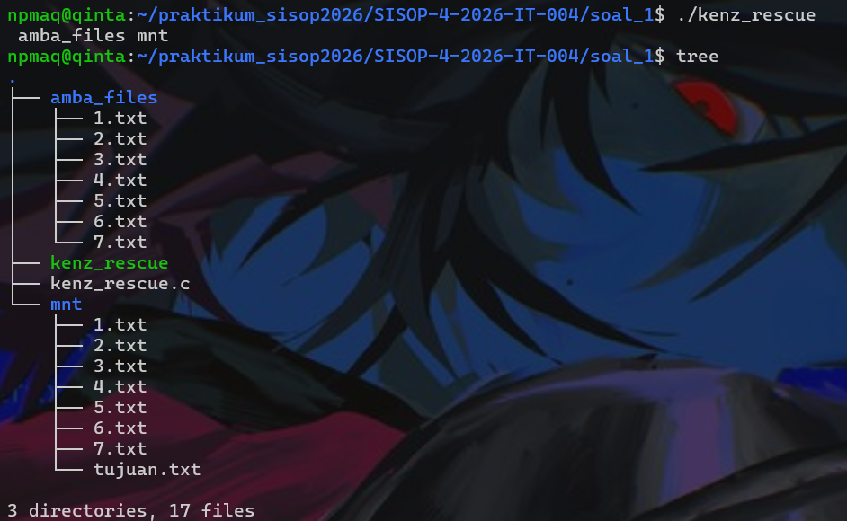<br>
#### 2. Isi tujuan.txt
<br>
#### 3. Status mount
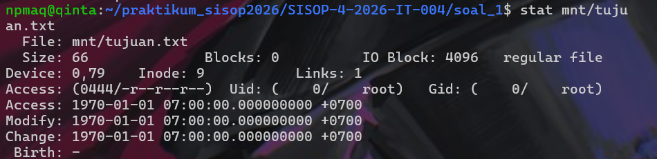<br>
#### 4. Jumlah byte
<br>
#### 5. Mematikan mount
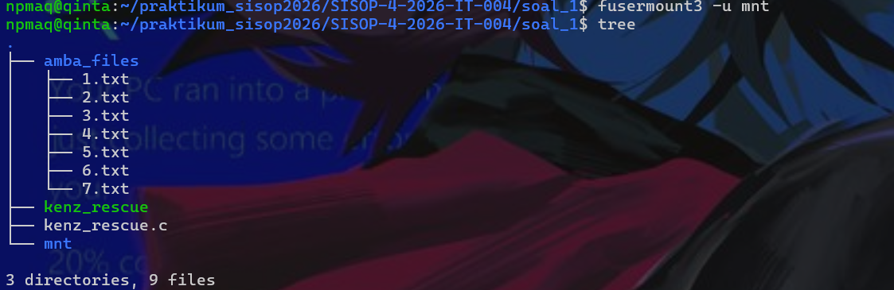<br>
### Kendala
Tidak ada kendala.

### Soal 2
Soal 2 meminta kita untuk mendownload file `server` pada link
```
https://drive.google.com/drive/folders/1e7-ScSf2xa3QQuIqAakhewfptyt4L3t-?usp=drive_link
```
Setelah mendownload file `server`, buat file agar bisa dijalankan dengan command:
```
chmod +x server
```
Kemudian jalankan command berikut sebagai persiapan lingkungan dan juga directory:
```bash
sudo apt update && sudo apt install -y fuse3 libfuse3-dev gcc docker.io
sudo modprobe fuse
mkdir -p encrypted_storage fuse_mount
```
Selanjutnya, buat `fuse.c` dengan kode sebagai berikut:
```c
#define FUSE_USE_VERSION 31

#include <fuse.h>
#include <stdio.h>
#include <stdlib.h>
#include <string.h>
#include <errno.h>
#include <fcntl.h>
#include <unistd.h>
#include <sys/stat.h>
#include <sys/types.h>
#include <dirent.h>

static char *source_dir = NULL;

#define ENC_KEY 0x76
```
Bagian ini merupakan bagian untuk mendefinisikan versi FUSE, menyediakan library yang digunakan, membuat variabel global untuk menyimpan path direktori asli yang akan di-mount, dan mendefinisikan kunci XOR dalam format heksadesimal.
```c
static void to_dir_path(char *buf, const char *path) {
    sprintf(buf, "%s%s", source_dir, path);
}

static void to_enc_path(char *buf, const char *path) {
    sprintf(buf, "%s%s.enc", source_dir, path);
}

static void xor_data(char *buf, size_t len) {
    for (size_t i = 0; i < len; i++)
        buf[i] ^= ENC_KEY;
}
```
Bagian ini berisi fungsi-fungsi untuk mengelola path file dan proses enkripsi dan dekripsi. Fungsi `to_dir_path()` membentuk path ke direktori atau file asli. Fungsi `to_enc_path()` menambahkan ekstensi `.enc` untuk mengakses file terenkripsi. Kemudian, fungsi `xor_data()` berfungsi untuk mengekripsi maupun mendekripsi isi data dengan operasi XOR menggunakan `ENC_KEY`.
```c
static int fs_getattr(const char *path, struct stat *stbuf,
                      struct fuse_file_info *fi) {
    (void)fi;
    char tmp[1024];
    memset(stbuf, 0, sizeof(struct stat));

    // Coba sebagai direktori
    to_dir_path(tmp, path);
    int res = lstat(tmp, stbuf);
    if (res == -1) {
        // Jika bukan direktori, coba sebagai file .enc
        to_enc_path(tmp, path);
        res = lstat(tmp, stbuf);
        if (res == -1)
            return -errno;
    }
    return 0;
}
```
Bagian ini digunakan untuk mengambil metadata file atau direktori saat mengakses filesystem.
```c
static int fs_readdir(const char *path, void *buf, fuse_fill_dir_t filler,
                      off_t offset, struct fuse_file_info *fi,
                      enum fuse_readdir_flags flags) {
    (void)offset; (void)fi; (void)flags;
    char tmp[1024];
    to_dir_path(tmp, path);

    DIR *dp = opendir(tmp);
    if (!dp)
        return -errno;

    struct dirent *de;
    while ((de = readdir(dp)) != NULL) {
        struct stat st;
        memset(&st, 0, sizeof(st));
        st.st_ino = de->d_ino;
        st.st_mode = de->d_type << 12; // perkiraan mode

        // Jika nama berakhiran .enc, tampilkan tanpa .enc
        if (strcmp(de->d_name, ".") == 0 || strcmp(de->d_name, "..") == 0)
            continue;

        char name[256];
        strcpy(name, de->d_name);
        int len = strlen(name);
        if (len > 4 && strcmp(name + len - 4, ".enc") == 0) {
            name[len - 4] = '\0';  // hilangkan .enc
        }

        if (filler(buf, name, &st, 0, 0))
            break;
    }
    closedir(dp);
    return 0;
}
```
Bagian ini berfungsi untuk menampilkan isi direktori saat user menjalankan perintah seperti `ls`. Fungsi ini membentuk path direktori asli dengan `to_dir_path()`, lalu membukanya menggunakan `opendir()` dan membaca setiap entri dengan `readdir()`.
```c
static int fs_mkdir(const char *path, mode_t mode) {
    char tmp[1024];
    to_dir_path(tmp, path);
    int res = mkdir(tmp, mode);
    if (res == -1)
        return -errno;
    return 0;
}
```
Fungsi ini menangani pembuatan direktori baru saat user menjalankan perintah seperti `mkdir`. Fungsi ini terlebih dahulu membentuk path lengkap di direktori asli menggunakan `to_dir_path()`, lalu memanggil fungsi sistem `mkdir()` dengan mode akses yang diberikan.
```c
static int fs_rmdir(const char *path) {
    char tmp[1024];
    to_dir_path(tmp, path);
    int res = rmdir(tmp);
    if (res == -1)
        return -errno;
    return 0;
}
```
Fungsi ini digunakan untuk menghapus direktori saat user menjalankan perintah seperti `rmdir`. Fungsi ini membentuk path lengkap ke direktori asli menggunakan `to_dir_path()`, lalu memanggil `rmdir()` untuk menghapusnya dari storage.
```c
static int fs_create(const char *path, mode_t mode,
                     struct fuse_file_info *fi) {
    char tmp[1024];
    to_enc_path(tmp, path);
    int fd = open(tmp, fi->flags | O_CREAT | O_WRONLY | O_TRUNC, mode);
    if (fd == -1)
        return -errno;
    fi->fh = fd;
    return 0;
}
```
Fungsi ini menangani pembuatan file baru. Fungsi ini membentuk path file terenkripsi dengan `to_enc_path()` sehingga file yang disimpan di storage otomatis memiliki ekstensi `.enc`, lalu membukanya dengan `open()`.
```c
static int fs_open(const char *path, struct fuse_file_info *fi) {
    char tmp[1024];
    to_enc_path(tmp, path);
    int fd = open(tmp, fi->flags);
    if (fd == -1)
        return -errno;
    fi->fh = fd;
    return 0;
}
```
Fungsi ini menangani proses membuka file dengan cara kerja yang mirip dengan fungsi `fs_create`.
```c
static int fs_read(const char *path, char *buf, size_t size, off_t offset,
                   struct fuse_file_info *fi) {
    (void)path;
    ssize_t res = pread(fi->fh, buf, size, offset);
    if (res == -1)
        return -errno;
    xor_data(buf, res);
    return res;
}
```
Fungsi ini menangani pembacaan isi file. Fungsi ini membaca data terenkripsi dari file menggunakan `pread()` berdasarkan file descriptor yang tersimpan di `fi->fh`, lalu jika pembacaan berhasil, data tersebut didekripsi dengan fungsi `xor_data()` menggunakan operasi XOR sehingga isi file yang tampil ke user menjadi bentuk aslinya.
```c
static int fs_write(const char *path, const char *buf, size_t size,
                    off_t offset, struct fuse_file_info *fi) {
    (void)path;
    // Buat salinan untuk dienkripsi
    char *enc_buf = malloc(size);
    if (!enc_buf)
        return -ENOMEM;
    memcpy(enc_buf, buf, size);
    xor_data(enc_buf, size);

    ssize_t res = pwrite(fi->fh, enc_buf, size, offset);
    free(enc_buf);
    if (res == -1)
        return -errno;
    return res;
}
```
Fungsi ini menangani penulisan data ke file. Fungsi ini terlebih dahulu membuat salinan data dari `buf` ke buffer baru `(enc_buf)` agar data asli tidak berubah, lalu mengenkripsinya menggunakan `xor_data()` dengan metode XOR.
```c
static int fs_truncate(const char *path, off_t size,
                       struct fuse_file_info *fi) {
    char tmp[1024];
    to_enc_path(tmp, path);
    int res;
    if (fi) {
        res = ftruncate(fi->fh, size);
    } else {
        int fd = open(tmp, O_WRONLY);
        if (fd == -1)
            return -errno;
        res = ftruncate(fd, size);
        close(fd);
    }
    if (res == -1)
        return -errno;
    return 0;
}
```
Fungsi ini digunakan untuk mengubah ukuran file, misalnya saat file dipotong atau dikosongkan. Fungsi ini membentuk path file terenkripsi dengan `to_enc_path()`, lalu memanggil `ftruncate()` untuk mengatur ukuran file menjadi `size`.
```c
static int fs_unlink(const char *path) {
    char tmp[1024];
    to_enc_path(tmp, path);
    int res = unlink(tmp);
    if (res == -1)
        return -errno;
    return 0;
}
```
Fungsi ini digunakan untuk menghapus file saat user menjalankan perintah seperti `rm`. Fungsi ini membentuk path lengkap file terenkripsi dengan `to_enc_path()`, lalu memanggil fungsi sistem `unlink()` untuk menghapus file tersebut dari storage.
```c
static int fs_access(const char *path, int mask) {
    char tmp[1024];
    // Coba direktori dulu
    to_dir_path(tmp, path);
    int res = access(tmp, mask);
    if (res == -1) {
        to_enc_path(tmp, path);
        res = access(tmp, mask);
    }
    if (res == -1)
        return -errno;
    return 0;
}
```
Fungsi ini digunakan untuk memeriksa apakah file atau direktori dapat diakses sesuai mode yang diminta, seperti izin baca, tulis, atau eksekusi. Fungsi ini terlebih dahulu mencoba mengecek akses pada path direktori asli menggunakan `to_dir_path()` dan `access()`.
```c
static int fs_utimens(const char *path, const struct timespec tv[2],
                      struct fuse_file_info *fi) {
    (void)fi;
    char tmp[1024];
    to_dir_path(tmp, path);
    int res = utimensat(AT_FDCWD, tmp, tv, 0);
    if (res == -1) {
        to_enc_path(tmp, path);
        res = utimensat(AT_FDCWD, tmp, tv, 0);
    }
    if (res == -1)
        return -errno;
    return 0;
}
```
Fungsi ini digunakan untuk mengubah timestamp file atau direktori, seperti waktu akses dan waktu modifikasi. Fungsi ini terlebih dahulu mencoba memperbarui waktu pada path direktori asli menggunakan `to_dir_path()` dan `utimensat()`.
```c
static struct fuse_operations fs_ops = {
    .getattr    = fs_getattr,
    .readdir    = fs_readdir,
    .mkdir      = fs_mkdir,
    .rmdir      = fs_rmdir,
    .create     = fs_create,
    .open       = fs_open,
    .read       = fs_read,
    .write      = fs_write,
    .truncate   = fs_truncate,
    .unlink     = fs_unlink,
    .access     = fs_access,
    .utimens    = fs_utimens,
};
```
Fungsi di atas berfungsi sebagai daftar callback untuk menghubungkan operasi filesystem FUSE dengan fungsi yang sudah dibuat. Setiap field menunjuk ke fungsi tertentu, seperti `fs_getattr` untuk mengambil metadata file, `fs_readdir` untuk menampilkan isi direktori, `fs_mkdir` dan `fs_rmdir` untuk membuat atau menghapus direktori, `fs_create`, `fs_open`, `fs_read`, dan `fs_write` untuk mengelola file, serta fungsi lain seperti `fs_truncate`, `fs_unlink`, `fs_access`, dan `fs_utimens` untuk operasi tambahan.
```c
int main(int argc, char *argv[]) {
    // source_dir diambil dari argumen pertama (jika ada)
    if (argc < 2) {
        fprintf(stderr, "Usage: %s <source_directory> [fuse options]\n", argv[0]);
        return 1;
    }
    source_dir = realpath(argv[1], NULL);
    if (!source_dir) {
        perror("realpath");
        return 1;
    }
    // Geser argumen agar FUSE tidak melihat direktori source
    argv[1] = argv[0];
    argv++;
    argc--;

    return fuse_main(argc, argv, &fs_ops, NULL);
}
```
Fungsi `main()` bertugas menyiapkan filesystem FUSE. Program terlebih dahulu memeriksa apakah user memberikan argumen direktori sumber; jika tidak, program menampilkan cara penggunaan dan berhenti. Jika ada, path direktori tersebut diubah menjadi path absolut dengan `realpath()` dan disimpan ke `source_dir`. Setelah itu, argumen digeser agar FUSE tidak membaca direktori sumber sebagai opsi mount, melainkan hanya melihat opsi FUSE yang diperlukan. Terakhir, `fuse_main()` dipanggil dengan `fs_ops` untuk menjalankan filesystem virtual dan menghubungkan semua operasi filesystem ke callback yang telah didefinisikan sebelumnya.  
Setelah `fuse.c` selesai, buat `client.c` dengan kode sebagai berikut:
```c
#include <stdio.h>
#include <stdlib.h>
#include <string.h>
#include <unistd.h>
#include <arpa/inet.h>
#include <sys/select.h>

#define SERVER_PORT 9000
#define BUFFER_SIZE 4096
```
Bagian di atas berfungsi sebagai library dan mendefinisikan server port dan ukuran buffer.
```c
void read_response(int sock) {
    char buf[BUFFER_SIZE];
    fd_set readfds;
    struct timeval tv;
    int ret;

    while (1) {
        FD_ZERO(&readfds);
        FD_SET(sock, &readfds);
        tv.tv_sec = 0;
        tv.tv_usec = 200000;   // 0.2 detik timeout

        ret = select(sock + 1, &readfds, NULL, NULL, &tv);
        if (ret < 0) {
            perror("select");
            break;
        } else if (ret == 0) {
            // Tidak ada data lagi, anggap respons selesai
            break;
        }

        ssize_t n = recv(sock, buf, sizeof(buf) - 1, 0);
        if (n <= 0) {
            if (n < 0) perror("recv");
            break;  // koneksi ditutup atau error
        }

        buf[n] = '\0';
        printf("%s", buf);
        fflush(stdout);
    }
}
```
Fungsi ini digunakan untuk membaca dan menampilkan data dari socket secara terus-menerus sampai respons selesai. Fungsi ini memakai `select()` dengan timeout 0,2 detik untuk mengecek apakah ada data yang siap dibaca tanpa membuat program menunggu terlalu lama.
```c
int main() {
    int sock;
    struct sockaddr_in server_addr;

    // Buat socket dan koneksikan sekali
    sock = socket(AF_INET, SOCK_STREAM, 0);
    if (sock < 0) {
        perror("socket");
        return 1;
    }

    server_addr.sin_family = AF_INET;
    server_addr.sin_port = htons(SERVER_PORT);
    if (inet_pton(AF_INET, "127.0.0.1", &server_addr.sin_addr) <= 0) {
        perror("inet_pton");
        close(sock);
        return 1;
    }

    if (connect(sock, (struct sockaddr*)&server_addr, sizeof(server_addr)) < 0) {
        perror("connect");
        close(sock);
        return 1;
    }

    printf("Terhubung ke server pada port %d.\n", SERVER_PORT);
    printf("Masukkan perintah (Ctrl+D untuk keluar):\n");

    char buf[BUFFER_SIZE];
    while (1) {
        printf("> ");
        fflush(stdout);

        if (fgets(buf, sizeof(buf), stdin) == NULL)
            break;

        // Hapus newline jika ada (opsional, server biasanya tidak peduli)
        size_t len = strlen(buf);
        if (len > 0 && buf[len-1] == '\n')
            buf[len-1] = '\0';

        // Jika kosong, lewati
        if (len == 0)
            continue;

        // Kirim perintah (tambahkan newline lagi karena server mungkin butuh)
        strcat(buf, "\n");
        if (send(sock, buf, strlen(buf), 0) < 0) {
            perror("send");
            break;
        }

        // Baca respons
        read_response(sock);
    }

    close(sock);
    printf("\nKoneksi ditutup.\n");
    return 0;
}
```
Fungsi `main()` merupakan program client socket yang membuat koneksi ke server di 127.0.0.1 pada SERVER_PORT. Program pertama membuat socket, mengatur alamat server, lalu mencoba terhubung. Jika gagal, program menampilkan error dan berhenti. Setelah berhasil terhubung, user bisa memasukkan perintah melalui terminal, kemudian input dibaca dengan fgets(), karakter newline dihapus, dicek agar tidak kosong, lalu dikirim ke server menggunakan send() (dengan newline ditambahkan kembali). Setelah mengirim, program memanggil read_response() untuk menerima dan menampilkan balasan server. Proses ini terus berulang sampai user menekan Ctrl+D atau terjadi error, lalu socket ditutup dan koneksi diakhiri.  
File terakhir yang harus dibuat adalah `Dockerfile` yakni sebagai berikut:
```Dockerfile
FROM ubuntu:latest

# Set working directory di dalam container
WORKDIR /app
RUN ln -s /lib/x86_64-linux-gnu/ld-linux-x86-64.so.2 /lib64/ld-linux-x86-64.so.2 2>/dev/null || true

# Salin binary server dari host ke container
COPY server /app/server

# Pastikan binary dapat dieksekusi
RUN chmod +x /app/server

# Buat direktori db (nantinya akan ditimpa bind mount)
RUN mkdir -p /app/db

# Ekspose port server
EXPOSE 9000

# Jalankan server
CMD ["./server"]
```
Dockerfile ini digunakan untuk membuat container berbasis `ubuntu:latest` yang menjalankan program server. `WORKDIR /app` menetapkan direktori kerja utama di dalam container, lalu dibuat symbolic link ke dynamic loader agar binary dapat berjalan kompatibel di beberapa environment. Perintah `COPY server /app/server` menyalin file binary server dari host ke container, kemudian `chmod +x` memberi izin eksekusi pada file tersebut. Direktori `/app/db` dibuat sebagai tempat penyimpanan database (biasanya bisa ditimpa dengan bind mount dari host), `EXPOSE 9000` mendeklarasikan bahwa container menggunakan port 9000, dan `CMD ["./server"]` menentukan bahwa saat container dijalankan, binary server akan langsung dieksekusi.  
Kemudian compile `fuse.c` dan `client.c` dengan command sebagai berikut:
```bash
gcc -Wall fuse.c -o fuse $(pkg-config fuse3 --cflags --libs)
gcc -Wall client.c -o client
```
Selanjutnya jalankan fuse dengan:
```bash
./fuse encrypted_storage fuse_mount
```
Build image Docker:
```bash
docker build -t soal-2-modul-4-sisop .
```
Jalankan container:
```bash
docker run -d --name db_app -v "$(pwd)/fuse_mount:/app/db" -p 9000:9000 soal-2-modul-4-sisop
```
Jalankan server dan client:
```bash
./server
./client
```
### Output
#### 1. Fuse
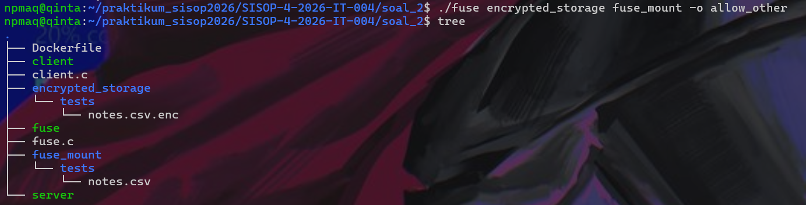<br>
#### 2. Menambahkan file dan isi teks ke dalam fuse_mount
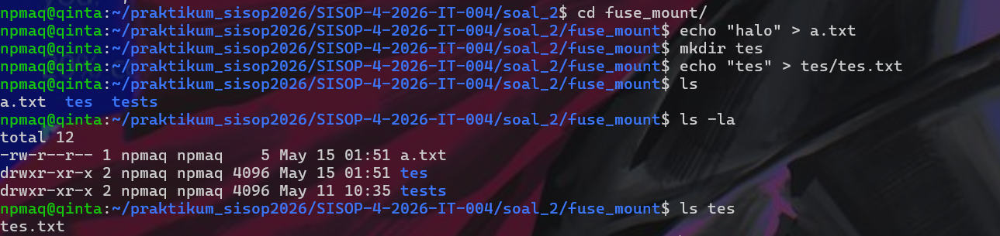<br>
#### 3. Mencoba membaca file enkripsi dan dekripsi
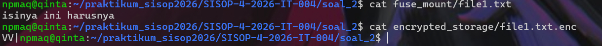<br>
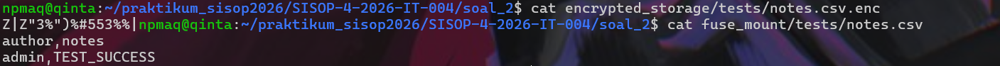<br>
#### 4. Cek docker image dan kontainer pada background
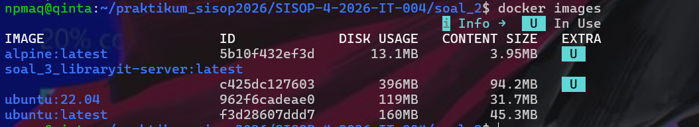<br>
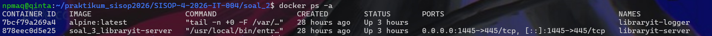<br>
#### 5. Menjalankan server dan client
<br>
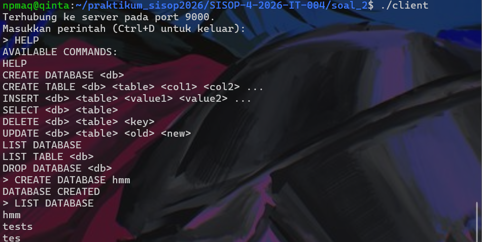<br>
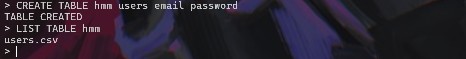<br>
### Kendala
Tidak ada kendala.

### Soal 3
Soal 3 meminta kita untuk membuat 4 file yakni `Dockerfile`, `docker-compose.yml`, `smb.conf`, dan `entrypoint.sh`. Selain itu, kita perlu membuat directory `data` dengan isi directory `ebooks`, `papers`, `sourcecode`, dan `docs`. Kemudian kita juga perlu membuat directory `logs` dengan isi directory `libraryit.logs`.  
Isi dari `Dockerfile` adalah sebagai berikut:
```Dockerfile
FROM ubuntu:22.04

RUN apt-get update && \
    DEBIAN_FRONTEND=noninteractive apt-get install -y samba && \
    rm -rf /var/lib/apt/lists/*

RUN mkdir -p /libraryit/ebooks /libraryit/papers /libraryit/sourcecode /libraryit/docs

COPY smb.conf /etc/samba/smb.conf
COPY entrypoint.sh /usr/local/bin/entrypoint.sh
RUN chmod +x /usr/local/bin/entrypoint.sh

RUN mkdir -p /var/log/samba

EXPOSE 445

ENTRYPOINT ["/usr/local/bin/entrypoint.sh"]
```
Dockerfile ini membuat container berbasis `ubuntu:22.04` yang berfungsi sebagai server Samba. Perintah `apt-get update` dan `apt-get install -y samba` menginstal layanan Samba, lalu cache package dihapus agar ukuran image lebih kecil. Direktori `/libraryit/ebooks`, `/papers`, `/sourcecode`, dan `/docs` dibuat sebagai shared folder yang akan diakses melalui Samba.  
Kemudian isi dari `docker-compose.yml` adalah sebagai berikut:
```yml
version: '3.8'

services:
  libraryit-server:
    build: .
    container_name: libraryit-server
    ports:
      - "1445:445"
    volumes:
      - ./data/ebooks:/libraryit/ebooks
      - ./data/papers:/libraryit/papers
      - ./data/sourcecode:/libraryit/sourcecode
      - ./data/docs:/libraryit/docs
      - ./logs/libraryit.log:/var/log/samba/libraryit.log   # mount file spesifik
    restart: unless-stopped

  libraryit-logger:
    image: alpine:latest
    container_name: libraryit-logger
    depends_on:
      - libraryit-server
    volumes:
      - ./logs/libraryit.log:/var/log/samba/libraryit.log:ro
    command: tail -n +0 -F /var/log/samba/libraryit.log
    restart: unless-stopped
```
File `docker-compose.yml` ini digunakan untuk menjalankan dua container sekaligus. Service `libraryit-server` akan membangun image dari `Dockerfile` di direktori saat ini, memberi nama container `libraryit-server`, memetakan port host 1445 ke port container 445 agar Samba bisa diakses dari luar, serta melakukan bind mount beberapa folder lokal (`ebooks`, `papers`, `sourcecode`, `docs`) ke direktori share di dalam container.  
Selanjutnya isi dari `smb.conf` adalah sebagai berikut:
```conf
[global]
   workgroup = WORKGROUP
   server string = LibraryIT Server
   security = user
   map to guest = never
   guest ok = no
   hide unreadable = yes
   load printers = no
   printing = bsd
   printcap name = /dev/null
   disable spoolss = yes
   
   # Matikan log Samba standar
   enable core files = no
   log file = /dev/null
   syslog = 0
   log level = 0
   
   # Audit hanya menulis ke /tmp agar tidak muncul di volume
   vfs objects = full_audit
   full_audit:prefix = %u|%I|%S
   full_audit:success = connect disconnect open opendir write mkdir rmdir
   full_audit:failure = connect disconnect open opendir write mkdir rmdir
   full_audit:log file = /tmp/audit_raw.log

[ebooks]
   path = /libraryit/ebooks
   read only = no
   valid users = @readonly, @staff
   write list = @staff
   force group = staff
   create mask = 0660
   directory mask = 0770

[papers]
   path = /libraryit/papers
   read only = no
   valid users = @readonly, @staff
   write list = @staff
   force group = staff
   create mask = 0660
   directory mask = 0770

[sourcecode]
   path = /libraryit/sourcecode
   read only = yes
   valid users = @staff
   force group = staff

[docs]
   path = /libraryit/docs
   read only = yes
   valid users = @readonly, @staff
   write list = librarian
   force group = staff
   create mask = 0660
   directory mask = 0770
```
File `smb.conf` ini merupakan konfigurasi Samba untuk membuat server file sharing LibraryIT dengan kontrol akses berbasis user dan grup. Pada bagian `[global]`, server diatur menggunakan workgroup `WORKGROUP`, autentikasi user aktif, akses guest ditolak, file yang tidak punya izin disembunyikan, fitur printer dimatikan, dan logging standar Samba dinonaktifkan agar tidak memenuhi volume log. Sebagai gantinya, modul `full_audit` digunakan untuk mencatat aktivitas penting seperti koneksi, membuka file, menulis, membuat, dan menghapus direktori ke `/tmp/audit_raw.log`. Empat share disediakan: `[ebooks]` dan [papers] bisa dibaca user grup `readonly` dan `staff`, tetapi hanya staff yang boleh menulis. `[sourcecode]` hanya bisa diakses oleh grup `staff` dalam mode read-only, sedangkan `[docs]` bisa dibaca oleh `readonly` dan `staff`, namun hanya user librarian yang diberi hak tulis. Opsi seperti `force group`, `create mask`, dan `directory mask` memastikan file baru selalu memiliki grup serta permission yang konsisten sesuai kebijakan server.  
Terakhir, file `entrypoint.sh` adalah sebagai berikut:
```sh
#!/bin/bash
set -e

echo "[*] Membuat group dan user..."

# Hapus grup staff bawaan Ubuntu (GID 50) jika ada
if getent group staff | grep -q '^staff:x:50:'; then
    groupdel staff
fi

# Buat grup staff dan readonly
getent group staff >/dev/null || groupadd -g 1001 staff
getent group readonly >/dev/null || groupadd -g 1002 readonly

# Buat user (tanpa primary group staff/readonly dulu)
id member &>/dev/null || useradd -m -s /bin/false member
id contributor &>/dev/null || useradd -m -s /bin/false contributor
id librarian &>/dev/null || useradd -m -s /bin/false librarian

# Tambahkan user ke grup yang sesuai (anggota tambahan)
usermod -aG readonly member
usermod -aG staff contributor
usermod -aG staff librarian

# Set password Samba
(echo "member123"; echo "member123") | smbpasswd -a -s member
(echo "contrib456"; echo "contrib456") | smbpasswd -a -s contributor
(echo "lib789"; echo "lib789") | smbpasswd -a -s librarian

smbpasswd -e member
smbpasswd -e contributor
smbpasswd -e librarian

echo "[*] Mengatur permission direktori koleksi..."

mkdir -p /libraryit/ebooks /libraryit/papers /libraryit/sourcecode /libraryit/docs

chown root:staff /libraryit/ebooks /libraryit/papers
chmod 775 /libraryit/ebooks /libraryit/papers

chown root:staff /libraryit/sourcecode
chmod 750 /libraryit/sourcecode

chown root:staff /libraryit/docs
chmod 775 /libraryit/docs          # Penting: 775 agar librarian bisa tulis

echo "[*] Memulai transformasi log..."

mkdir -p /var/log/samba
chmod 755 /var/log/samba
touch /var/log/samba/libraryit.log
chmod 644 /var/log/samba/libraryit.log

# Parsing log standar Samba (log.smbd) ke format yang diminta
tail -F /var/log/samba/log.smbd | while read -r line; do
    timestamp=$(date "+%Y-%m-%d %H:%M:%S")
    if echo "$line" | grep -q "connect to service"; then
        user=$(echo "$line" | sed -n 's/.*as user \([^ ]*\).*/\1/p')
        share=$(echo "$line" | sed -n 's/.*connect to service \([^ ]*\).*/\1/p')
        echo "[$timestamp] [INFO] [$user] [CONNECT] [$share]" >> /var/log/samba/libraryit.log
    elif echo "$line" | grep -q "NT_STATUS_ACCESS_DENIED"; then
        user=$(echo "$line" | grep -oP 'user=\K[^ ]*')
        file=$(echo "$line" | grep -oP 'file=\K[^ ]*')
        [ -z "$file" ] && file="unknown"
        echo "[$timestamp] [WARNING] [$user] [DENIED] [$file]" >> /var/log/samba/libraryit.log
    elif echo "$line" | grep -qE "opened file.*write|create_file|write_file|open.*O_WRONLY"; then
        user=$(echo "$line" | grep -oP 'user=\K[^ ]*')
        file=$(echo "$line" | grep -oP 'file=\K[^ ]*')
        echo "[$timestamp] [INFO] [$user] [WRITE] [$file]" >> /var/log/samba/libraryit.log
    fi
done &

echo "[*] Memulai Samba..."
exec smbd --foreground --no-process-group
```
Script `entrypoint.sh` ini berfungsi menginisialisasi container sebelum server Samba dijalankan. Script dimulai dengan `set -e` agar langsung berhenti jika terjadi error, lalu membuat grup `staff` dan `readonly` serta menghapus grup bawaan Ubuntu jika bentrok. Setelah itu dibuat tiga user (member, contributor, librarian), masing-masing dimasukkan ke grup sesuai hak akses, kemudian password Samba diatur dan akun diaktifkan. Selanjutnya, skrip membuat direktori koleksi (`ebooks`, `papers`, `sourcecode`, `docs`) dan mengatur ownership serta permission agar sesuai aturan akses share. Setelah struktur file siap, script menyiapkan file log `/var/log/samba/libraryit.log`, lalu menjalankan proses `tail -F` untuk memantau log mentah Samba (`log.smbd`) dan mengubahnya ke format log yang lebih rapi, seperti mencatat event koneksi, akses ditolak, dan aktivitas penulisan file. Terakhir, perintah `exec smbd --foreground --no-process-group` menjalankan server Samba di foreground agar container tetap aktif dan melayani koneksi client.
### Output
#### 1. Docker untuk melihat anggota perpustakaan dan directory libraryit
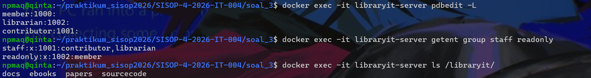<br>
#### 2. Samba untuk hak akses anggota perpustakaan
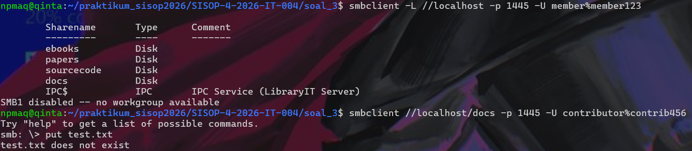<br>
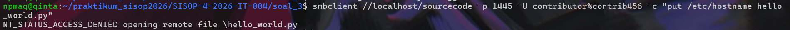<br>
#### 3. Melihat directory data dan sourcecode
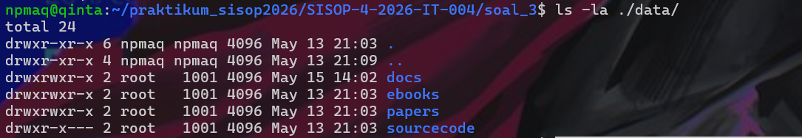<br>
<br>
#### 4. Logging
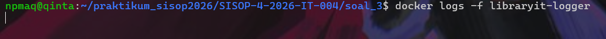<br>
### Kendala
1. Akses anggota perpustakaan masih terdapat bug
2. Logger tidak bisa jalan.
